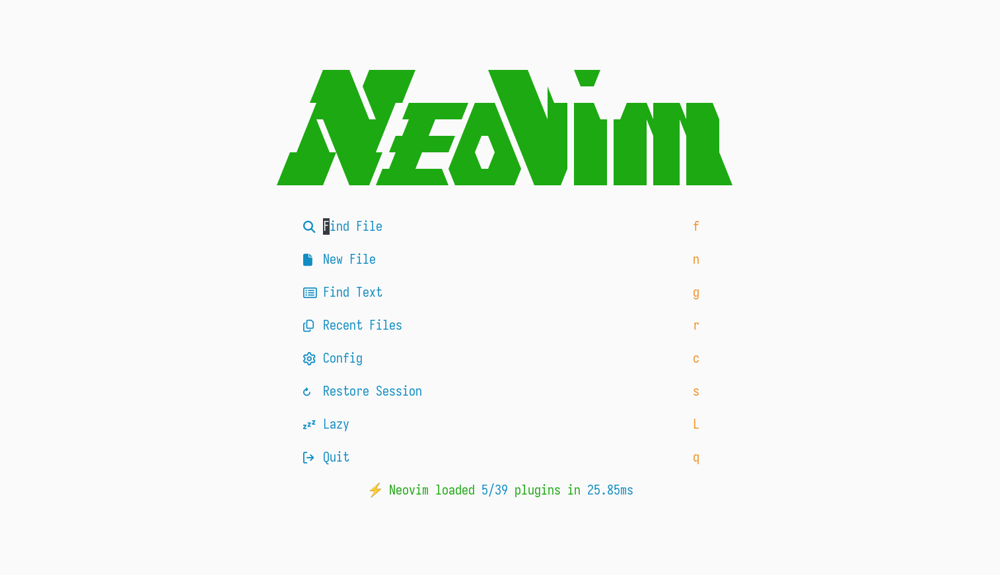

This repository stores my Neovim configuration meant for general programming use, inspired by [LazyVim](https://www.lazyvim.org). This is mainly aimed towards Linux and Neovim 0.9.x but may work otherwise.

## Features & Plugins

- 🚀 Fast (70–80 ms startup time)
- 🍊 Written in [Fennel](https://fennel-lang.org) via [tangerine](https://github.com/udayvir-singh/tangerine.nvim)
- 💤 Lazy-loading and package management with [lazy](https://github.com/folke/lazy.nvim)
- ⚙️  Automatic LSP server setup with [Mason](https://github.com/williamboman/mason.nvim) and [mason-lspconfig](https://github.com/williamboman/mason-lspconfig.nvim)
- 🌳 Syntax highlighting with [Treesitter](https://github.com/nvim-treesitter/nvim-treesitter)
- 🔍 Searching with [Telescope](https://github.com/nvim-telescope/telescope.nvim)
- 💄 Improved UI with [Noice](https://github.com/folke/noice.nvim)
- 🎛️ Dashboard with [Alpha](https://github.com/goolord/alpha-nvim)
- ⌚ Status line with [lualine](https://github.com/nvim-lualine/lualine.nvim)
- 📑 Buffer line with [bufferline](https://github.com/akinsho/bufferline.nvim)
- 📁 File system tree with [Neo-tree](https://github.com/nvim-neo-tree/neo-tree.nvim)
- ⚡ Jumping and searching with [flash](https://github.com/folke/flash.nvim)
- 🛑 Git integration with [GitSigns](https://github.com/lewis6991/gitsigns.nvim)
- 💻 Terminal integration with [toggleterm](https://github.com/akinsho/toggleterm.nvim) and [smart-splits](https://github.com/mrjones2014/smart-splits.nvim)
- 🛸 Better folding with [nvim-ufo](https://github.com/kevinhwang91/nvim-ufo)
- 📝 Code outline with [Aerial](https://github.com/stevearc/aerial.nvim)
- 🖇️  Multiple cursor support with [multicursors](https://github.com/smoka7/multicursors.nvim)
- ⌨️ Key maps registered with [WhichKey](https://github.com/folke/which-key.nvim)

*And many other sensible plugins and defaults!*
