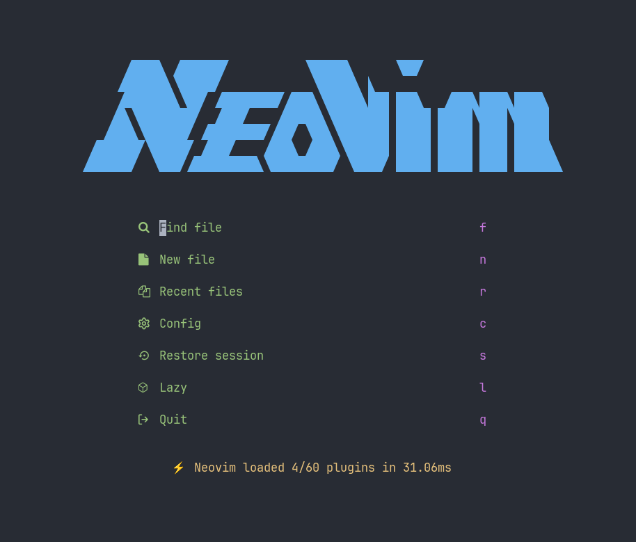

This repository stores my Neovim configuration meant for general programming use, inspired by [LazyVim](https://www.lazyvim.org). This is mainly aimed towards Linux and Neovim 0.9/0.10 but may work otherwise.

## Features & Plugins

- 🚀 Fast (40-50 ms startup time)
- 🍊 Written in [Fennel](https://fennel-lang.org) via [tangerine](https://github.com/udayvir-singh/tangerine.nvim)
- 💤 Lazy-loading and package management with [lazy](https://github.com/folke/lazy.nvim)
- ⚙️  Automatic LSP server setup with [mason](https://github.com/williamboman/mason.nvim) and [mason-lspconfig](https://github.com/williamboman/mason-lspconfig.nvim)
- 🌳 Syntax highlighting with [treesitter](https://github.com/nvim-treesitter/nvim-treesitter)
- 🔍 Searching with [telescope](https://github.com/nvim-telescope/telescope.nvim)
- 💄 Improved UI with [noice](https://github.com/folke/noice.nvim)
- 🎛️ Dashboard with [dashboard](https://github.com/nvimdev/dashboard-nvim)
- ⌚ Status line with [lualine](https://github.com/nvim-lualine/lualine.nvim)
- 📑 Buffer line with [bufferline](https://github.com/akinsho/bufferline.nvim)
- 🏓 Animations with [mini.animate](https://github.com/nvim-mini/mini.animate)
- 🍞 Breadcrumbs with [barbecue](https://github.com/utilyre/barbecue.nvim)
- 📁 File tree and symbols outline with [neotree](https://github.com/nvim-neo-tree/neo-tree.nvim)
- ⚡ Jumping and searching with [flash](https://github.com/folke/flash.nvim)
- 🛑 Git integration with [gitsigns](https://github.com/lewis6991/gitsigns.nvim)
- 💻 Terminal integration with [toggleterm](https://github.com/akinsho/toggleterm.nvim)
- 🛸 Better folding with [nvim-ufo](https://github.com/kevinhwang91/nvim-ufo)
- ⌨️ Key maps registered with [which-key](https://github.com/folke/which-key.nvim)

*And many other sensible plugins and defaults!*
